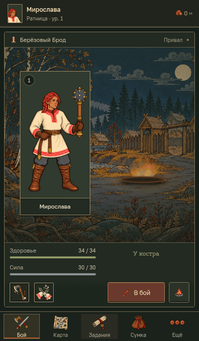
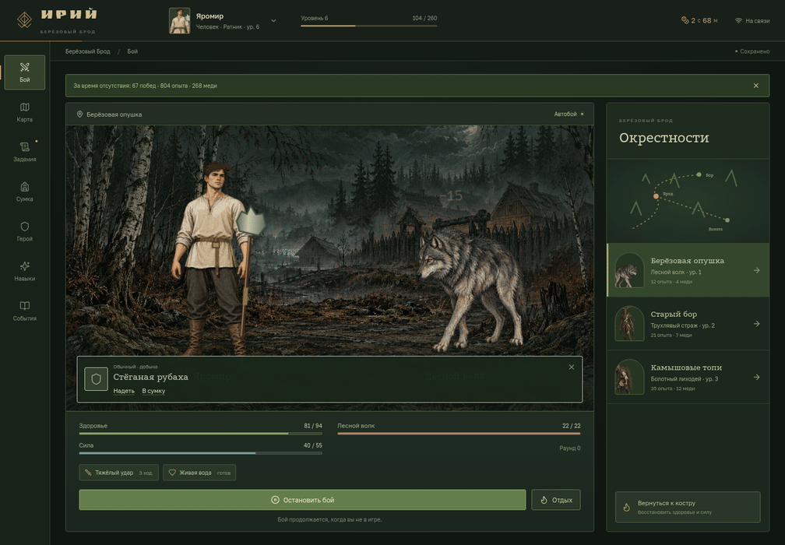
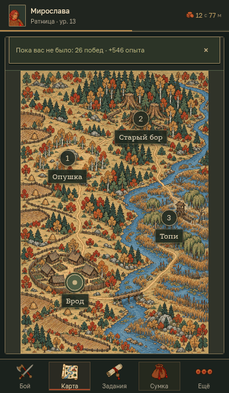
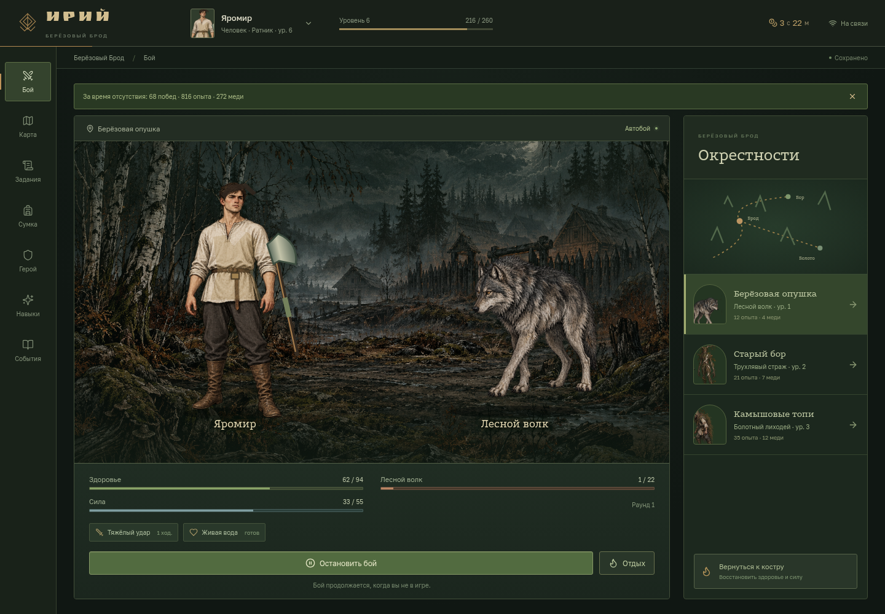
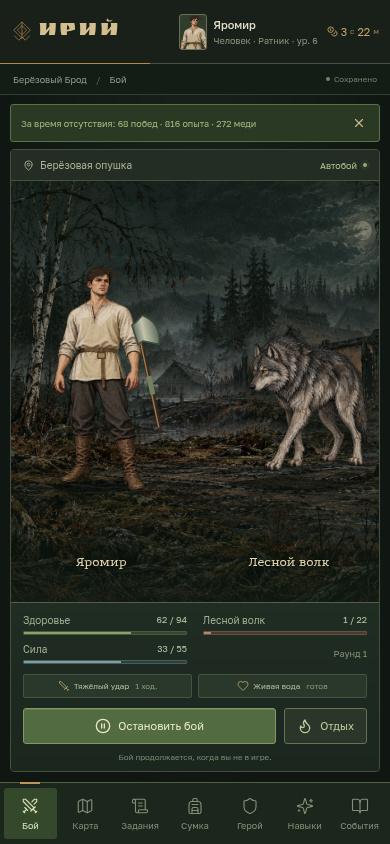
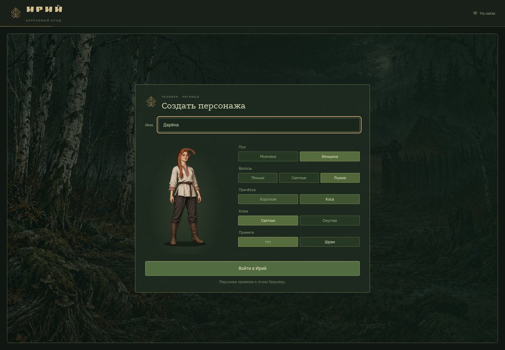

# ИРИЙ

Браузерный idle-autobattler в вымышленном славянском мире. Первая локация — Берёзовый Брод: волчья опушка, Старый бор с трухлявыми стражами и камышовая переправа, захваченная лиходеями. Персонаж — человек-ратник; при создании можно выбрать мужскую или женскую внешность, волосы, причёску, тон кожи и шрам.

Автоматический бой использует попадания, критические удары, броню, ману и приоритет умений. Два выбранных умения срабатывают самостоятельно по условиям и восстановлению. Добыча имеет четыре редкости; оружие, броня и оберег меняют изображение персонажа. Есть три связанных поручения, опыт, уровни и офлайн-прогресс до восьми часов. [Механики и формулы](docs/GAMEPLAY.md) · [Мир и история](docs/WORLD.md).

Тёмный интерфейс разделён на бой, карту, поручения, сумку, персонажа, умения и журнал. На десктопе характеристики находятся в шапке. На телефоне экран занимает высоту устройства, а длинные списки прокручиваются внутри выбранной вкладки. Иллюстрации созданы в стиле маргиналий; шрифты Ruslan Display, Podkova и Golos Text поставляются локально и поддерживают кириллицу.

## Посмотреть игру

Скриншоты и GIF записаны в настоящем браузере. Запуск интерактивной версии описан ниже; публичный сервер пока не размещён.

### Бой



### Добыча и экипировка



### Переходы по локации



Карта переключает места охоты внутри Берёзового Брода. Свободного перемещения персонажа пока нет. Для воспроизводимой записи используется отдельный демонстрационный персонаж; бой и награды обрабатываются обычным серверным движком.

### Десктоп



### Телефон — 390 × 844



### Создание персонажа



## Состояние проекта

Прогресс хранится в PostgreSQL. Несколько игроков имеют изолированные персонажи и сессии; общие взаимодействия, торговля и постоянные аккаунты ещё не реализованы. Старое состояние персонажа мигрирует в новую тематику с сохранением уровня, предметов и выполненных поручений.

Проверки и их границы описаны в [VALIDATION.md](VALIDATION.md).

## Запуск

Нужны Node.js 22.12+, npm и Docker с Compose.

```sh
cp .env.example .env
# Замените пароль в POSTGRES_PASSWORD и DATABASE_URL одинаковым случайным значением.
npm ci
docker compose up -d
npm run db:migrate
npm run dev
```

Откройте http://localhost:5173. API: http://localhost:3001. Файл `.env` не отслеживается Git. Сервис требует PostgreSQL и не подменяет его памятью или localStorage. API можно запускать отдельно: `npm run start -w @azeroth/server`.

## Предпросмотр игры

После настройки `.env` и запуска PostgreSQL можно открыть собранную игру без Vite и прокси:

```sh
npm run preview
```

Интерфейс и API доступны вместе на http://localhost:4173; прогресс сохраняется в той же PostgreSQL. Команда собирает клиент и запускает сервер. Адрес привязан к компьютеру, на котором запущена команда; в удалённой среде потребуется проброс порта 4173. Это локальный предпросмотр, для размещения в интернете используйте HTTPS-конфигурацию ниже.

## Развёртывание на собственном домене

`compose.production.yaml` запускает PostgreSQL без внешнего порта, отдельный процесс миграций, непривилегированный API и Caddy с автоматическим HTTPS. API подключается через ограниченную роль `azeroth_app`, которая не может менять схему; пароль администратора получает только PostgreSQL и одноразовый мигратор. Прокси служит единственной точкой входа, поэтому API доверяет одному прокси для корректного ограничения частоты по IP.

Добавьте в `.env` `DOMAIN=idle.example.com` и отдельный случайный `PGAPP_PASSWORD` (для паролей в URL используйте hex или корректное URL-кодирование). Настройте DNS на сервер и откройте порты 80/443. Затем:

```sh
docker compose -f compose.production.yaml up -d --build
```

Публичное размещение в этой работе не выполнено: конфигурация требует вашего домена и сервера. Инициализация роли применяется только к новой БД; не используйте эту конфигурацию с уже существующим томом, пока не создадите роль и не выдадите ей нужные права. Для нескольких API-инстансов потребуется общий ограничитель запросов вместо встроенного ограничения одного процесса.

## Проверки

```sh
npm run typecheck
npm test
npm run build
```

Интеграционные тесты PostgreSQL требуют `TEST_DATABASE_URL`, указывающий на отдельную тестовую базу. CI создаёт её автоматически. Не направляйте тестовые подключения в боевую БД. Тесты без доступной тестовой БД могут пропускать интеграционные сценарии — проверяйте отчёт Vitest.

## Границы модулей

- `packages/game`: типизированные игровые определения, чистая симуляция, команды-намерения, ограничение офлайн-прогресса, детерминированный генератор случайности. Не зависит от React, HTTP или PostgreSQL.
- `apps/server`: HTTP, сессии, валидация, ограничение частоты, транзакции, сохранение. Клиент не присылает опыт, валюту, награды или время симуляции.
- `apps/web`: React-компоненты и отображение серверного состояния. Vite проксирует `/api` к серверу; браузер отправляет только намерения.
- `database/migrations`: последовательные SQL-миграции с контрольными суммами и транзакционной блокировкой мигратора.

Каждый персонаж хранится как версионированный агрегат JSONB. Отдельные таблицы содержат игроков, сессии и квитанции идемпотентности. Такой формат сохраняет целостность персонажа в одной транзакции; рыночные ордера, гильдии и общие ресурсы впоследствии должны получить собственные нормализованные таблицы. `schemaVersion` задаёт границу миграции игрового состояния, SQL-миграции — схемы хранения.

Награды и бой вычисляются по серверным часам. `SELECT ... FOR UPDATE` сериализует команды одного игрока между инстансами API. Ключ идемпотентности защищает повтор команды, привязан к игроку и содержимому команды. Гостевая сессия использует непрозрачный случайный токен в HttpOnly cookie; в базе хранится только SHA-256. Прогресс продолжается лениво: при запросе или возвращении игрока сервер вычисляет пропущенные тики; отдельный постоянный таймер для каждого игрока не нужен.

## Развёртывание и ограничения первого среза

Это самостоятельный Node.js/PostgreSQL-проект. Для продакшена размещайте собранный `apps/web/dist` и API за одним HTTPS-доменом, задайте `NODE_ENV=production`, точный `APP_ORIGIN` и секрет подключения к PostgreSQL. PostgreSQL не должен быть публично доступен; используйте ограниченного пользователя БД, резервные копии и проверку восстановления. Локальный Compose открывает порт БД только на loopback.

Пока реализованы гостевые персонажи в отдельных сессиях. Нет постоянных аккаунтов, восстановления доступа между устройствами, торговли, PvP, чата и гильдий. Несколько игроков могут независимо играть через один API; общие игровые взаимодействия ещё не реализованы. Истечение или удаление cookie лишает гостя доступа к персонажу, поэтому полноценная авторизация обязательна перед открытым запуском.

Перед публичным запуском нужны постоянные аккаунты, операционный мониторинг, регулярный запуск `npm run db:cleanup`, нагрузочное тестирование и пользовательский QA. Схема специально оставляет эти расширения вне игрового движка. Архитектура уменьшает будущие изменения, но не обещает полностью исключить рефакторинг.
